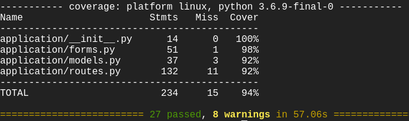

# QA SFIA 1
## Robot Testing Interface
The goal of this project was to create a CRUD web application; with CRUD standing for:
- **C**reate
- **R**ead
- **U**pdate
- **D**elete

As no specification was given regarding the topic, the goal was to create a web application for the purpose of recording results obtained from the testing of robotics. The system is capable of keeping records on many different types of robot models and navigation algorithms, in addition to the results that would be achieved from these.  

## Design
This project is being approached using an agile framework, making use of a kanban board.
### Kanban Board
The kanban board was used to create a backlog of issues that would need to be completed in order to complete this application. The tasks were divided into stories, determined by the topic that the issue related to, with the stories themselves being divided into epics, focusing on the larger scale of the application. 
An example of the kanban board in use is seen below:
 

### Entity Relationship Diagram
The database for this application was designed using an entity relationship diagram, shown below.
The database consists of four tables, with their respective primary keys:
- Users
- Robots
- Algorithms
- Results

The results table consists of several foreign keys, connecting this table to several others that will contain relevant information regarding the tables contents. 

As can be seen above, the results table has a one-to-many relationship with all other tables in the database. This was the design as the goal of this system was to allow the user to compare several navigation algorithms and robot models.

## Creation
The creation of this project required the use of many different technologies to be succesfully used in conjunction.
### Version control
The version control system used during this project was git, where a repository was created. This repository served as a central source code management system, using a branching workflow model. For each additional feature a branch would be created for the development of this feature. Once the new source code was created, integrated and tested successfully a pull request was created and the new branch was merged into the master. 

### Cloud server
A hosting system for this application was necessary to its creation. For this purpose a *google cloud services* server with the Ubuntu 18.04 Linux operating system containing no graphical user interface. A local git repository was created on this server as the counterpart to the repository being stored on github. 
This local git repository was edited directly on this server utilising the vim text editor, which could then be added and commited to the remote repository on the current feature branch.

### Database
A secondary SQL server was required to function as the database storage for the back-end portion of this web application. Two different databases were created, one for the testing of the application and the other for the released application. The required IP of the Ubuntu Linux was approved for connection to the SQL server, enabling communication between the different servers. This communication was handled by the __**SQLAlchemy**__ python library that allows for SQL queries and commands to be used in python-style commands.
Models were created with the same design as the entity relationship diagram, which could then be used to create the tables as necessary. 

### Back-end
The back-end of the application refers to the processing of data before the moving either to or from the database. The first section of the back-end required were the forms necessary for data entry, utilising Flask WTForms. These forms were added to the routes, allowing for the information inputted to these forms to be added to the relevant databases and tables within the respective databases. The items within each form can be seen in the Entity Relationship Diagram above. 

### Front-end
The front-end components of this application was created using HTML (**H**yper**T**ext **M**arkup **L**anguage), with logic being provided by the Jinja2 library. The use of the Jinja2 library allowed for the accessing of variables and the use of python code within the HTML pages. 
A layout HTML page was created for the other pages to inherit from, requiring a navigation bar to only be created once. 

## Testing
Once the back-end and front-end of the application was completed, in-depth testing was required to ensure the functionality of the front-end, back-end and the database. This testing was carried out in two stages that could be repeated;
1. Unit Testing
2. Integration Testing

both of which utilising the pytest module to display the testing coverage and to create a testing report giving more detail to the tests.

Overall, the two testing stages achieved a combined coverage of 95%.
 
### Unit Testing
The purpose of unit testing is to test small portions of the code in controlled environments. To organise these tests, categories were created in order to simplify the testing process. These categories include:
- Views
- Login
- Registration
- Addition of records
- Deletion of records
- Updating of records

Each of these categories contain tests regarding the overarching category. The  tests were fashioned in this way to improve extendibility, maintenance and refactoring.

#### Views
The view tests ensured that all necessary pages on the web application are accessible to users who have the proper authorisation to access them, representing the *Read* portion of the CRUD acronym. A successful page view is asserted as receiving a status code of 200.

#### Login
The login tests ensured that a registered user is able to log in and access the features that can only be used when the user is logged in. These user only options include:

    - Adding records
    - Deleting records
    - Updating records

#### Registration
Testing the registration of users consisted of additional names, emails and passwords being successfully submitted to the users table in the database. The success of this test indicates that additional users can create their own accounts to record results. 

#### Addition of records
Adding records to the different tables in the databases correctly was one of the most important features, and represents the *Create* portion of the CRUD acronym. This testing was carried out by adding records to the robot, algorithm and results tables and then checking their respective pages to ensure the correct addition. 

#### Deletion of records
Representing the *Delete* portion of the CRUD acronym, testing that a record can be deleted is an important aspect as certain records in the database may become redundant over time. This testing was completed by using the test of creating records, and then utilising the delete function to remove the records entirely. A feature was placed in the html page of the corresponding table that will display only if there are no records found to be displayed. 

#### Updating of records
The final portion of the CRUD acronym is the *Update* feature that allows an authorised user to make changes to an existing record in the database. Like the deletion testing, the code to create a record was included at the beginning of the test. Once a new entry was created, this record would then be updated. The relevant page would then be checked to ensure that the update had taken effect. 

## System Integration & Build

Upon pushing source code to the git repository, the application should be tested before being deployed to a production server. As with the creation and testing areas of the application lifecycle, *Google Cloud Services* was used in this stage. Utilising Jenkins, an open source automation server, the previously discussed testing is automatically applied to the source code. Once the applied testing has passed successfully, it will trigger the deployment of the web application within jenkins.
The deployment of the application was handled by the gunicorn application, as it provided a customisable number of workers and can provide a custom access port after the IP address. This application allows for the web application to be accessed through a web browser.

